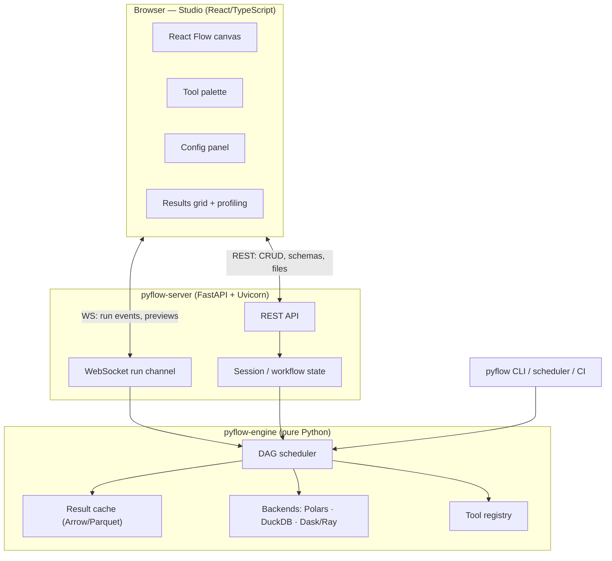
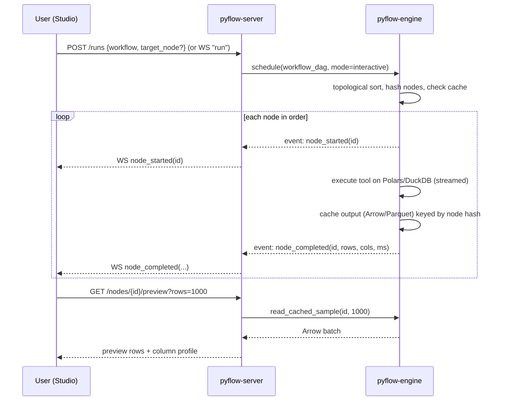

# 01 — Architecture

## 1. Overview

Pyflow is a **local-first client/server application** plus a **standalone execution engine**.

- The **Studio frontend** (React + React Flow) renders the canvas and panels in the browser.
- The **Pyflow server** (FastAPI) serves the app, exposes REST + WebSocket APIs, and orchestrates runs.
- The **Pyflow engine** (pure Python) is where workflows actually execute. It has *no* web dependency
  and can run a `.pyflow` file headless from the CLI, a scheduler, or CI.

## 2. Components and responsibilities

### 2.1 Studio frontend (`apps/studio`)
- Renders the canvas, tool palette, per-tool config forms, and the results/profiling panel.
- Owns *view* state (positions, selection, zoom, undo/redo) and mirrors *document* state (the workflow).
- Auto-generates config forms from each tool's JSON-Schema config spec.
- Streams run status over WebSocket and renders per-node badges (queued/running/done/error) + record counts.
- Requests output previews (sampled) for the selected node.
- **Never executes data logic** — it is a pure view/controller over the server + engine.

### 2.2 Pyflow server (`packages/server`)
- Serves the built frontend and the HTTP/WS APIs (see [Backend API](07-backend-api.md)).
- Manages **sessions**: an open workflow, its cached results, and its run lifecycle.
- Validates workflows (schema, type-compatibility of connections) before running.
- Translates GUI actions into engine calls and relays engine events back over WebSocket.
- Brokers filesystem/data-source browsing within a configured, allow-listed root.
- Stateless w.r.t. business logic — all heavy lifting is delegated to the engine.

### 2.3 Pyflow engine (`packages/engine`)
- **The core product.** Parses a workflow into a DAG, schedules it, executes each tool, moves data
  between tools as Arrow/Polars frames, caches results, and emits events.
- Contains the **tool registry**, the **type system**, the **backend adapters**, and the **runtime**
  (run context, caching, streaming, cancellation).
- Depends only on data libraries (Polars, DuckDB, PyArrow, Pydantic) — no FastAPI, no React.
- Fully usable as a Python library and via the `pyflow` CLI.

### 2.4 Tool SDK (`packages/sdk`)
- The stable, public surface tool authors import (`from pyflow_sdk import Tool, config, anchors`).
- Re-exports the minimal engine types needed to declare anchors, config schemas, and `execute` logic.
- Isolating this from engine internals lets us refactor the engine without breaking third-party tools.

## 3. Technology stack

### Frontend
| Concern | Choice | Rationale |
| --- | --- | --- |
| Framework | **React 18 + TypeScript** | Ecosystem, hiring, React Flow |
| Canvas | **React Flow (@xyflow/react)** | Purpose-built node/edge canvas: pan/zoom, anchors, minimap |
| Build/dev | **Vite** | Fast HMR, simple builds |
| State | **Zustand** | Minimal, ergonomic store for document + view state |
| Data grid | **TanStack Table + TanStack Virtual** (AG Grid Community as fallback) | Virtualized large previews |
| Code/formula editor | **Monaco** | Autocomplete for fields + functions |
| Forms | **JSON-Schema-driven** (react-jsonschema-form or custom renderer) | Auto-built config panels |
| Transport | Native `fetch` + `WebSocket`, TanStack Query for REST cache | Simple, standard |

### Backend / engine
| Concern | Choice | Rationale |
| --- | --- | --- |
| Language | **Python 3.11+** | Modern typing, performance, match statements |
| Web framework | **FastAPI + Uvicorn** | Async, WebSocket, Pydantic-native, OpenAPI |
| Schemas/validation | **Pydantic v2** | Config models → JSON Schema for the UI, fast validation |
| Default dataframe | **Polars (Lazy)** | Fast, multithreaded, streaming/out-of-core |
| SQL / OLAP / out-of-core | **DuckDB** | Larger-than-memory SQL, Parquet, joins/aggregations |
| Interchange | **Apache Arrow / PyArrow** | Zero-copy between Polars, DuckDB, and the wire |
| Distributed (optional) | **Dask** and/or **Ray** | Cluster-scale execution behind the backend abstraction |
| File formats | Parquet, Arrow IPC, CSV, JSON, Excel (`fastexcel`/`openpyxl`) | Cache + I/O |
| Packaging | **uv / hatch**, entry-points for plugins | Fast installs, plugin discovery |
| Testing | pytest, hypothesis, Playwright (e2e) | Unit → golden-workflow → e2e |

### Distribution
- `pip install pyflow-studio` → `pyflow studio` boots the server and opens the browser. *(Planned — not
  yet on PyPI; install from source today, see the [README](../README.md#installation).)*
- `pyflow run workflow.pyflow` → headless execution.
- Later: a **pywebview** desktop shell bundling Python + the built frontend into a single app.

## 4. Data flow (an interactive run)

Key properties:
- **Incremental:** a node is re-executed only if its config or any upstream node changed (hash-keyed cache).
- **Sampled previews:** the grid pulls a bounded sample from cache; full data is never shipped to the browser.
- **Cancellable:** a stop signal propagates cooperatively; the engine checks a cancellation token between batches.

## 5. Deployment modes

| Mode | Who | Shape |
| --- | --- | --- |
| **Local single-user** (default MVP) | Analyst on a laptop | `pyflow studio` → localhost server + engine in one process/host |
| **Headless run** | CI, cron, another orchestrator | `pyflow run file.pyflow` → engine only |
| **Self-hosted multi-user** (Phase 4) | Small team | Server + workers, shared workflow gallery, auth |
| **Desktop app** (Phase 4) | Non-technical users | pywebview shell, no manual server start |

## 6. Process & concurrency model

- The server is **async**; long runs execute in a **worker** (process/thread pool, or a separate
  process for isolation) so the event loop stays responsive and runs are cancellable.
- Each **session** owns an isolated run context and cache directory.
- Tools that execute **user code** (Python/SQL tools) run in a constrained subprocess/sandbox — see
  [Non-Functional Requirements §Security](09-non-functional.md).
- The backend abstraction means the *same* tool code dispatches to Polars, DuckDB, or Dask without the
  tool author writing backend-specific branches (see [Execution Engine](03-execution-engine.md)).

## 7. Why the engine is separate from the server (design rationale)

Isolating `pyflow-engine` from `pyflow-server` is the single most important structural decision:

- **Reproducibility:** the GUI and production runs share one code path — what you build is what runs.
- **Testability:** the engine is tested as a plain library (fast, deterministic, no browser).
- **Portability:** the engine can be embedded in notebooks, Airflow/Dagster tasks, or Lambda-style jobs.
- **Refactorability:** the web layer can change (or be replaced by a desktop shell) without touching
  execution semantics.
