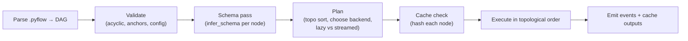

# 03 — Execution Engine

The engine turns a `.pyflow` DAG into results. It is the core of the product and is independent of the
GUI (see [Architecture §7](01-architecture.md)). This document specifies how it schedules, executes,
scales, and caches.

---

## 1. Design goals

1. **Lazy & pushdown-aware** — build a query plan; let Polars/DuckDB prune columns and push down
   filters/predicates instead of materializing intermediate tables.
2. **Larger-than-memory by default** — streaming and out-of-core execution, not "load it all into RAM".
3. **Incremental** — re-run only what changed, using a content-addressed cache.
4. **Backend-pluggable** — the same tool runs on Polars, DuckDB, or Dask/Ray without tool-author branching.
5. **Cancellable & observable** — cooperative cancellation; a stream of progress events per node.

---

## 2. Execution lifecycle



1. **Parse** the workflow into an in-memory DAG of node objects.
2. **Validate** structure (acyclic), anchors (required inputs connected), and configs (schema-valid).
3. **Schema pass** — compute each node's output schema (metadata only), enabling UI hints & type checks.
4. **Plan** — topologically sort; pick a backend and a materialize/stream strategy per node.
5. **Cache check** — compute each node's hash; reuse cached output where the hash is unchanged.
6. **Execute** — run nodes in order (with safe parallelism across independent branches), moving Arrow
   data between them, spilling to disk as needed, emitting events, and caching outputs.

## 3. Scheduling

- **Topological order** with **branch parallelism**: independent branches of the DAG can execute
  concurrently (bounded by a worker pool); a node runs once all its inputs are ready.
- **Run modes:**
  - **Interactive** — triggered from the GUI; may operate on a bounded **sample** for instant feedback,
    or full data on demand. Targets a specific node (run *up to here*).
  - **Full run** — the whole workflow to completion (used by outputs, CLI, scheduler).
- **Partial runs** — "run to selected node" executes only that node's ancestors.
- **Cancellation** — a cancellation token is checked between record batches and before each node; the
  engine unwinds cooperatively and marks in-flight nodes as `cancelled`.

## 4. The backend abstraction

Tools are written against a **backend-neutral frame API**, and the engine dispatches to a concrete
backend. This is the mechanism that delivers "big data without rewriting tools."

```python
# Conceptual — the surface a tool sees
class Frame(Protocol):
    """A lazy, backend-neutral table handle."""
    def schema(self) -> Schema: ...
    def select(self, cols) -> "Frame": ...
    def filter(self, expr) -> "Frame": ...
    def with_columns(self, exprs) -> "Frame": ...
    def group_by(self, keys) -> "GroupedFrame": ...
    def join(self, other, on, how) -> "Frame": ...
    def to_arrow_batches(self) -> Iterator[pa.RecordBatch]: ...
```

| Backend | When used | Strengths | Notes |
| --- | --- | --- | --- |
| **Polars (Lazy)** | Default | Fast, multithreaded, streaming/out-of-core, rich expressions | Primary path for most tools |
| **DuckDB** | SQL tool, huge joins/aggregations, direct Parquet/DB scan, in-DB pushdown | Out-of-core SQL, superb joins, reads remote/columnar sources | Zero-copy via Arrow |
| **Dask** (optional, Phase 3) | Datasets/clusters beyond a single machine | Distributed partitions, familiar | Behind the same Frame API |
| **Ray** (optional, Phase 3) | Distributed + heavy Python UDFs | Scales arbitrary Python tools | Behind the same Frame API |

**Backend selection** is automatic (heuristics: data size, operation type, source locality) with a
manual override per-workflow or per-node ("run this on DuckDB"). Interchange between backends is always
**Apache Arrow** (zero-copy where possible), so a Polars branch can feed a DuckDB node cheaply.

### 4.1 Expressions

Tool configs express column logic (Filter predicates, Formula outputs) as a **Pyflow expression AST**
that compiles to the active backend:
- Polars → `pl.Expr`
- DuckDB → SQL expression string
This keeps the **formula language identical** regardless of backend (see
[Tool Catalog §Formula](04-tool-catalog.md#formula)).

## 5. Streaming vs materialization

The engine classifies each tool:

| Class | Examples | Behavior |
| --- | --- | --- |
| **Streaming (1:1 / 1:N per batch)** | Select, Filter, Formula, Sample(head) | Process batch-in → batch-out; constant memory |
| **Blocking (needs all rows)** | Sort, Unique, Summarize (group-by), Join | Buffer/spill via backend; Polars streaming or DuckDB out-of-core |
| **Source** | Input Data, Text Input, DB Input | Emit batches; push down projection/predicate to the reader |
| **Sink** | Output Data, Browse | Consume the stream; write to file/DB or cache a preview |

For blocking operations on big data, the engine **prefers DuckDB or Polars streaming** so spilling
happens in native code, not Python.

## 6. Caching & incremental re-runs

Every node output is cached to disk (Arrow IPC/Parquet) under the session cache dir, keyed by a
**content hash**:

```
node_hash = H(tool_type, tool_version, normalized_config, input_hashes[...], engine_version)
```

- On re-run, a node whose `node_hash` is unchanged **reuses its cached output** — only the edited node
  and its descendants recompute. This makes iterative editing fast, Alteryx-style.
- Cache entries store the **schema + a bounded sample** for instant previews plus a pointer to full data.
- Caches are **session-scoped** by default and cleaned on close; an opt-in **persistent cache** speeds
  repeated runs of the same workflow.
- A **cache-eviction** policy (size/age bounds) prevents unbounded disk growth.

## 7. Events & observability

During a run the engine emits a typed event stream consumed by the server → WebSocket → UI:

```jsonc
{ "type": "node_started",   "node": "n2", "ts": 1719758400.12 }
{ "type": "node_progress",  "node": "n2", "rows": 250000, "pct": 0.4 }
{ "type": "node_message",   "node": "n2", "level": "warn",
  "text": "12 rows failed date parse; set to null" }
{ "type": "node_completed", "node": "n2", "rows": 480123, "cols": 9, "ms": 812,
  "cached": false }
{ "type": "node_error",     "node": "n5", "error": "JoinKeyTypeMismatch",
  "detail": "[cust_id] int64 vs [id] string" }
{ "type": "run_completed",  "ms": 3410, "nodes": 6 }
```

Each tool can also emit **messages** (info/warn/error) that surface in the results panel — mirroring
Alteryx's per-tool message log (e.g. "N records had conversion errors").

## 8. Error handling

- **Config/validation errors** are caught in the schema pass and shown before running.
- **Runtime errors** mark the node `error`, halt its downstream branch, but let independent branches
  continue; the UI shows the failing node and message.
- **Recoverable data issues** (bad parses, nulls) are configurable per tool: error, warn+null, or drop.
- Errors are **structured** (code + human message + offending field/value) for actionable UI display.

## 9. Big-data strategy (summary)

| Data scale | Path |
| --- | --- |
| Fits in RAM | Polars eager/lazy, fully in-memory |
| Larger than RAM, single machine | Polars **streaming** engine + **DuckDB** out-of-core, spill to disk |
| Beyond one machine | **Dask/Ray** backend (Phase 3), same tools, partitioned execution |
| Data already in a warehouse | **Push down** to DuckDB / (later) an Ibis-style in-DB path so compute runs where the data lives |

The guiding rule: **move as little data into Python as possible** — scan columnar sources directly,
push filters/projections to the reader, and let native engines do the heavy joins and aggregations.

## 10. Headless & programmatic use

The same engine runs without any server:

```bash
pyflow run customer_cleanup.pyflow --var input=data/june.csv --out results/
pyflow run customer_cleanup.pyflow --to n5          # run up to a node
pyflow validate customer_cleanup.pyflow             # schema/type check only
```

```python
from pyflow_engine import Workflow
wf = Workflow.load("customer_cleanup.pyflow")
result = wf.run()                     # full run
frame = wf.node("n5").output()        # inspect any node's output as Arrow/Polars
```

This is what makes Pyflow workflows deployable in cron, CI, Airflow/Dagster tasks, or notebooks with
**identical semantics to the GUI**.
